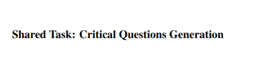

### Welcome to 12th Workshop on Argument Mining (ACL 2025) Shared Task -- Critical Questions Generation

Welcome to the official shared task website for Critical Questions Generation, a shared task hosted in [12th Workshop on Argument Mining](https://argmining-org.github.io/2025/)!

TODO: EXPLAIN THE TASK

_The information on this website is subject to change._ 
TODO: contact information

#### What is Critical Questions Generation?
TODO: explain the task detailed

#### How will participants be evaluated?
TODO: explain evaluation and link the evaluation script

#### Participant info
TODO: explain how to sign for the task and how to submit

#### Data
Below are links to access the data already released, as well as provisional expected release dates for future splits.
Do note that release dates are subject to change.

| Dataset split | Access |
|---|---|
| **Sample set** | To be published |
| **Validation set** | To be published |
| **Unlabeled train set** | To be published |
| **Unlabeled test set** | To be published |
| **Labeled test set** | To be published |

<!-- 
### add as: <a href="slkdfjaldsf.zip" download>download</a> (v1)
-->

TODO: release of the simple baseline system

#### Important dates

This information is subject to change.
- Sample data available: To be announced
- Validaiton data ready: To be announced
- Evaluation start: To be announced
- Evaluation end: To be announced
- Paper submission due: To be announced
- Notification to authors: To be announced
- Camera ready due: To be announced
- Workshop: 31th July (co-located with ACL 2025)

#### Organizers of the shared task

- [Blanca Calvo Figueras](https://github.com/BlancaCalvo), 
HiTZ Basque Center for Language Technology - Ixa, University of the Basque Country UPV/EHU, Spain
- [Rodrigo Agerri](https://ragerri.github.io/), 
HiTZ Basque Center for Language Technology - Ixa, University of the Basque Country UPV/EHU, Spain
- [Elena Cabrio](https://www-sop.inria.fr/members/Elena.Cabrio/), 
University of Côte d’Azur and member of the Inria-I3S research team Wimmics
- [Serena Villata](https://webusers.i3s.unice.fr/~villata/Home.html), 
University of Côte d’Azur and member of the Inria-I3S research team Wimmics

#### Still have questions?
TODO: indicate comunication channels and potentially create a FAQS website
