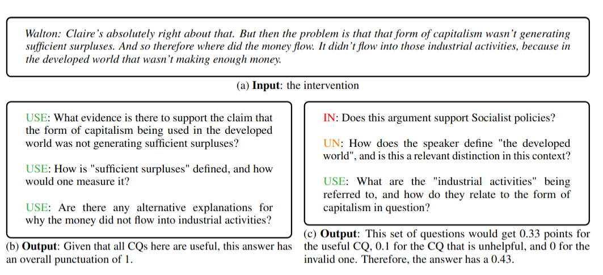

## Critical Questions Generation Shared Task

Welcome to the official website of the Critical Questions Generation shared task, hosted in [The 12th Workshop on Argument Mining](https://argmining-org.github.io/2025/), and co-located in [ACL 2025](https://2025.aclweb.org/) in Vienna, Austria!

In recent years, a growing concern within the educational community has been whether the widespread use of LLM-based chats could foster superficial learning habits and weaken students' critical thinking skills. To counter this trend, in this task, we propose using LLMs to guide users towards asking critical questions. That is, questions that can uncover fallacious or poorly constructed arguments. In short: **we want to foster critical thinking by developing a system that generates insightful critical questions when given argumentative texts**.

In the same line, Natural Language Processing applications to deal with misinformation are a popular line of research. However, most applications face challenges regarding three issues: LLMs often lack the required up-to-date knowledge for these tasks, there is not always an agreement on what is the truth, and LLMs themselves can produce hallucinations or rely on unfaithful data, generating misinformation of their own making. **Yet, instead of requiring the LLMs to output factual knowledge, could we use them to point at the missing or potentially uninformed claims?**


#### What is the task of Critical Questions Generation?

The task of Critical Questions Generation consists of generating useful critical questions when given an argumentative text. For this purpose, a dataset of real debate interventions with associated critical questions will be released.

**Critical Questions** are the set of inquiries that should be asked in order to judge if an argument is acceptable or fallacious. Therefore, these questions are designed to unmask the assumptions held by the premises of the argument and attack its inference.

In the dataset, the argumentative texts are interventions of real debates, which have been annotated with Argumentation Schemes and later associated to a set of critical questions. For every intervention, the speaker, the set of Argumentation Schemes, and the critical questions are provided. These questions have been annotated according to their usefulness for challenging the arguments in each text. The labels are either Useful, Unhelpful, or Invalid. The goal of the task is to generate critical questions that are Useful. 

The participant will be asked to develop a system that gets one of the interventions as input, and outputs exactly 3 critical questions. The 3 critical questions should all be useful for challenging the arguments in the intervention. Each of this 3 critical questions will be evaluated separately and then the punctuation will be aggregated. You can either create a system that generates only Useful CQs, or you can decide to generate many and choose the top 3. 

For more information on Critical Questions Generation, please read [Critical Questions Generation: Motivation and Challenges](https://aclanthology.org/2024.conll-1.9/).

#### How will participants be evaluated?

Each output containing 3 questions will be given a score between 0 and 1, depending on the usefulness of the critical questions. 

Useful critical questions (CQs) will be given 0.33 points, Unhelpful and Invalid CQs will have 0 points. The definitions of these categories are:

- **Useful (USE)**: The answer to this question can potentially challenge one of the arguments in the text.
- **Unhelpful (UN)**: The question is valid, but it is unlikely to challenge any of the arguments in the text.
- **Invalid (IN)**: This question is invalid because it can't be used to challenge any of the arguments in the text. Either because (1) its reasoning is not right, (2) the question is not related to the text, (3) it introduces new concepts not present in the intervention, (4) it is too general and could be applied to any text, or (5) it is not critical with any argument of the text (e.g. a reading-comprehension question).

See two output examples and their punctuation:



Each question will be evaluated in regards to the reference questions. That is, we will match the question with one of the references using semantic similarity and give the questions this label. You can find the evaluation guidelines used to label the reference CQs [here](https://github.com/hitz-zentroa/shared-task-critical-questions-generation/tree/main/shared_task/utils).

You can find the evaluation script [here](https://github.com/hitz-zentroa/shared-task-critical-questions-generation/tree/main/shared_task/eval_scripts).

#### Participant info

In order to participate, please fill this [Form](https://forms.gle/RZ9yHGQGz2tfCxY99) (one time per team).

Each team will be allowed 3 submissions, which will all be submitted through this Form (will be available on the 28th of March). 

The submissions should match the following format:

```json
{
    "CLINTON_1_1": {
        "intervention_id": "CLINTON_1_1",
        "intervention": "CLINTON: \"The central question in this election is really what kind of country we want to be and what kind of future we 'll build together\nToday is my granddaughter 's second birthday\nI think about this a lot\nwe have to build an economy that works for everyone , not just those at the top\nwe need new jobs , good jobs , with rising incomes\nI want us to invest in you\nI want us to invest in your future\njobs in infrastructure , in advanced manufacturing , innovation and technology , clean , renewable energy , and small business\nmost of the new jobs will come from small business\nWe also have to make the economy fairer\nThat starts with raising the national minimum wage and also guarantee , finally , equal pay for women 's work\nI also want to see more companies do profit-sharing\"",
        "dataset": "US2016",
        "cqs": [
            {
                "id": 0,
                "cq": "What does the author mean by \"build an economy that works for everyone, not just those at the top\"?"
            },
            {
                "id": 1,
                "cq": "What is the author's definition of \"new jobs\" and \"good jobs\"?"
            },
            {
                "id": 2,
                "cq": "How will the author's plan to \"make the economy fairer\" benefit the working class?"
            }
        ]
    },
...
}
```

You can find an example of a system and the generated output in [here](https://github.com/hitz-zentroa/shared-task-critical-questions-generation/tree/main/shared_task/trial_submission). 

#### Data

Below are links to access the data already released, as well as provisional expected release dates for future splits.
Do note that release dates are subject to change.

| Dataset split | Access |
|---|---|
| **Sample set** | <a href="https://github.com/hitz-zentroa/shared-task-critical-questions-generation/blob/main/shared_task/data_splits/sample.json" download>download</a> (v1) |
| **Validation set** | To be published |
| **Unlabeled train set** | To be published |
| **Unlabeled test set** | To be published |
| **Labeled test set** | To be published |

<!-- 
### add as: <a href="slkdfjaldsf.zip" download>download</a> (v1)
-->

#### Important dates

This information is subject to change.
- Sample data available: 17th February
- Validation data ready: 21st February
- Evaluation start: 28th March
- Evaluation end: 4th April
- Paper submission due: 25th April
- Notification to authors: 2nd May
- Camera ready due: 9th May
- Workshop: 31st July (co-located with ACL 2025)


#### Organizers of the shared task

- [Blanca Calvo Figueras](https://github.com/BlancaCalvo), 
HiTZ Basque Center for Language Technology - Ixa, University of the Basque Country UPV/EHU, Spain
- [Rodrigo Agerri](https://ragerri.github.io/), 
HiTZ Basque Center for Language Technology - Ixa, University of the Basque Country UPV/EHU, Spain
- [Elena Cabrio](https://www-sop.inria.fr/members/Elena.Cabrio/), 
University of Côte d’Azur and member of the Inria-I3S research team Wimmics
- [Serena Villata](https://webusers.i3s.unice.fr/~villata/Home.html), 
University of Côte d’Azur and member of the Inria-I3S research team Wimmics

#### Do you have other questions?

Please become a member of the [Google Group](https://groups.google.com) "critical-questions-generation-shared-task" to keep yourself updated. 
For specific questions, contact [blanca.calvo@ehu.eus](mailto:blanca.calvo@ehu.eus)
